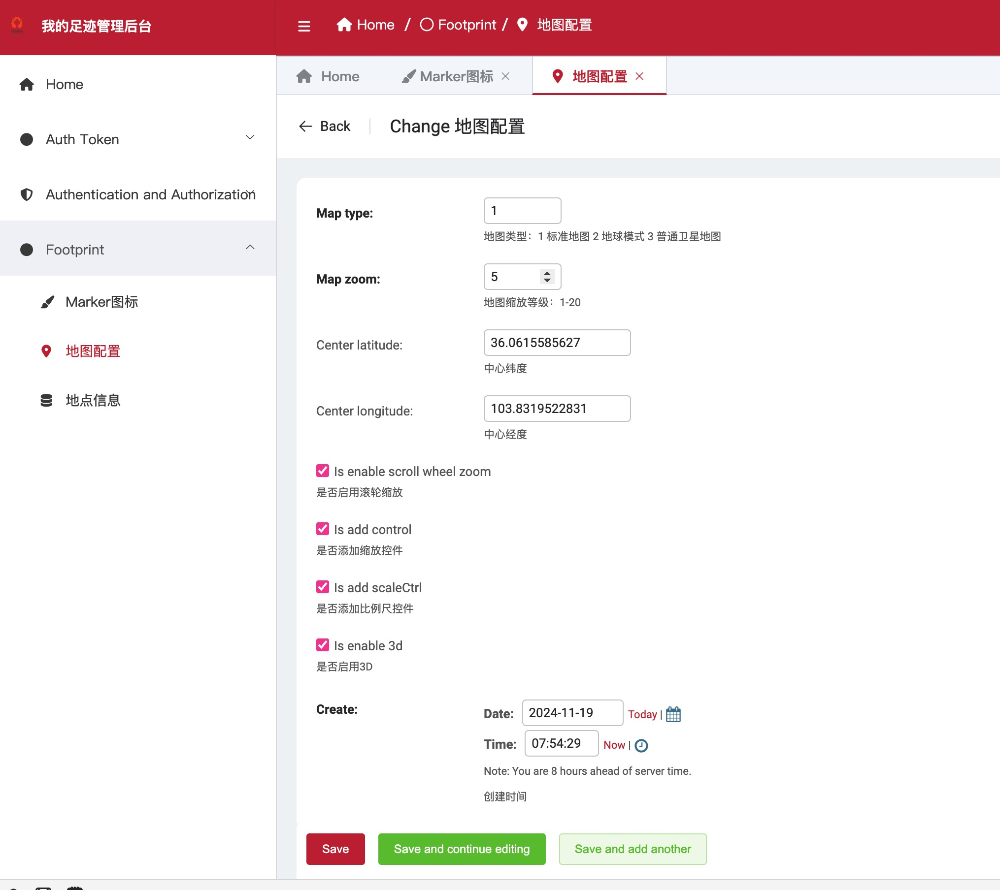
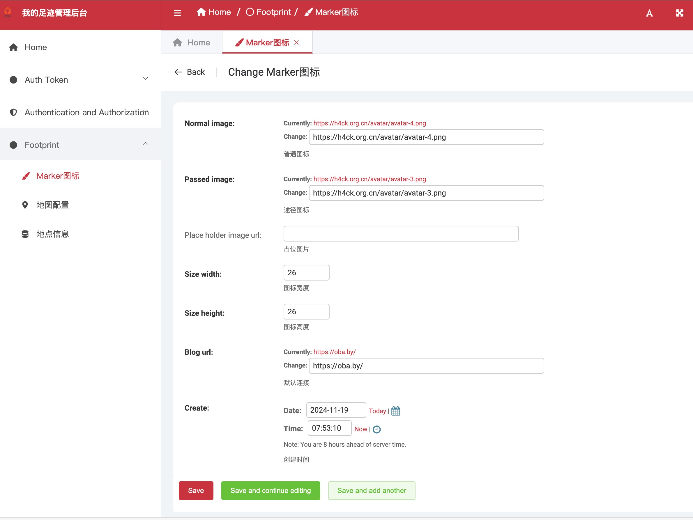
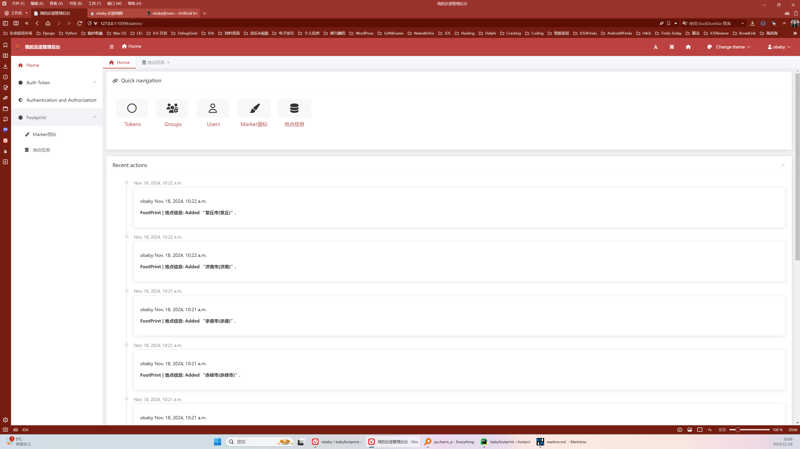
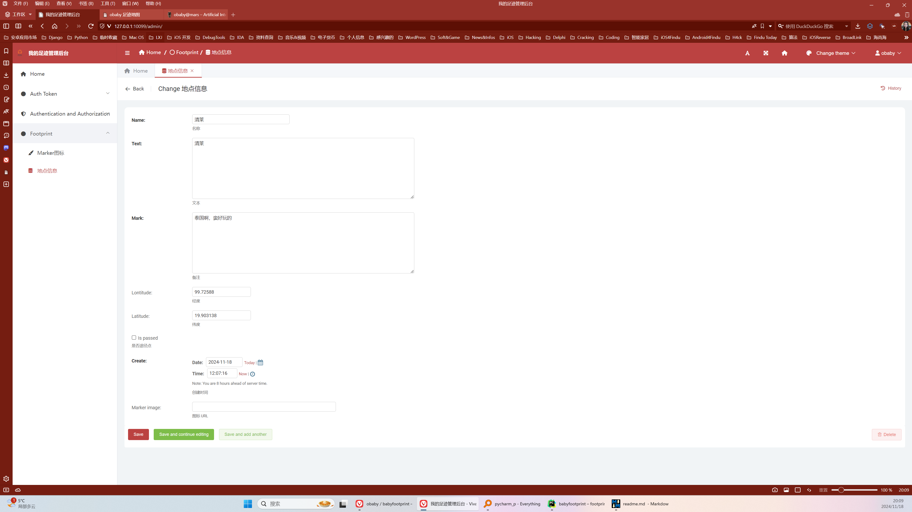
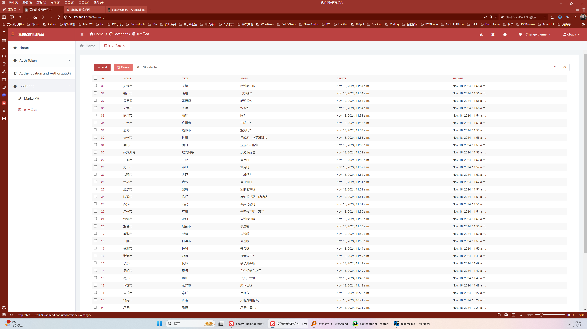
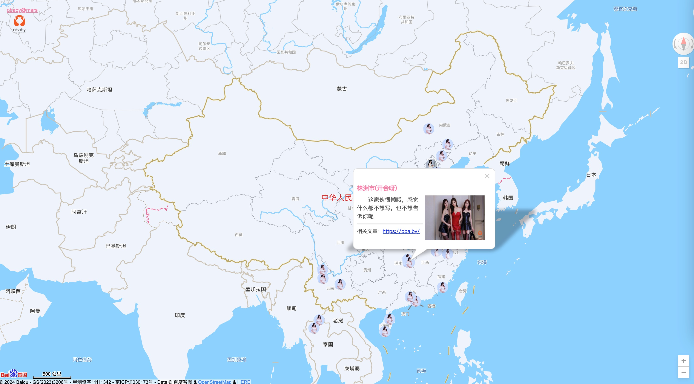

# Baby 足迹地图  


## 简介：  
基于百度地图的足迹地图。  
启动服务之后，先去后台 地图 key 设置页面，添加百度地图浏览器端 ak！  
启动服务之后，先去后台 地图 key 设置页面，添加百度地图浏览器端 ak！  
启动服务之后，先去后台 地图 key 设置页面，添加百度地图浏览器端 ak！  

为了防止 js 地址解析受限，需要同时添加服务端 ak！  
为了防止 js 地址解析受限，需要同时添加服务端 ak！  
为了防止 js 地址解析受限，需要同时添加服务端 ak！  

添加之后，访问： http://127.0.0.1:10099/api/location/process-my-location/ 地址刷新数据库的地点坐标信息，后续无需再通过 js 接口进行解析！  

## 功能(marker以及地图配置可以创建多条，默认生效为最后一条配置信息)  
* 支持后台添加位置信息
* 支持添加带gps坐标的位置信息  
* 支持全局自定义marker图标  
* 支持配置地图模式，# 1.标准地图：BMAP_NORMAL_MAP# 2.地球模式：BMAP_EARTH_MAP# 3.普通卫星地图：BMAP_SATELLITE_MAP
* 支持单个 marker 设置图标
* 支持全局设置弹窗默认图片
* 支持全局设置默认博客链接
* 支持设置地图中心点坐标


## docker运行：  
`docker run -p 10086:10086 obaby/baby-footprint:1.0`  

## 安装运行：  
python 3.8 - 3.10   
  
`pip install -r requirements.pip`  

## 启动服务 建议使用nginx反代：  
` python3 manage.py runserver 0.0.0.0:10086`  

## docke 打包
`docker build -t baby-footprint:1.0 .`

## 代码更新：  
在更新之前备份 db.sqlite数据库  
pull 新代码
将数据库放回原处 执行：  
` python3 manage.py migrate   `
然后重新启动服务  

### 后台登录地址：  
http://127.0.0.1:10086/admin/  


登录账号：obaby  
默认密码：123456   


## 修改：
所有配置登录后台进行设置  不需要修改代码默认生效规则为最后一条    

1.地图配置：  
  
2.图标配置：


## 截图：  

### 后台首页： 
  

### 添加地点：
  

**（如果不带gps坐标或者坐标无效，将会通过百度地图api解析gps坐标）**

### 列表：  


### 首页：
  


## 扩展内容 nginx反代： 

```
server
    {
        listen 443 ssl http2;
        #listen [::]:443 ssl http2;
        server_name footprint.h4ck.org.cn ;
        index index.html index.htm index.php default.html default.htm default.php;
        root  /home/wwwroot/footprint.h4ck.org.cn;

        ssl_certificate /home/lighthouse/footprint.h4ck.org.cn_nginx/footprint.h4ck.org.cn_bundle.pem;
        ssl_certificate_key /home/lighthouse/footprint.h4ck.org.cn_nginx/footprint.h4ck.org.cn.key;
        ssl_session_timeout 5m;
        ssl_protocols TLSv1 TLSv1.1 TLSv1.2 TLSv1.3;
        ssl_prefer_server_ciphers on;
        ssl_ciphers "TLS13-AES-256-GCM-SHA384:TLS13-CHACHA20-POLY1305-SHA256:TLS13-AES-128-GCM-SHA256:TLS13-AES-128-CCM-8-SHA256:TLS13-AES-128-CCM-SHA256:EECDH+CHACHA20:EECDH+CHACHA20-draft:EECDH+AES128:RSA+AES128:EECDH+AES256:RSA+AES256:EECDH+3DES:RSA+3DES:!MD5";
        ssl_session_cache builtin:1000 shared:SSL:10m;
        # openssl dhparam -out /usr/local/nginx/conf/ssl/dhparam.pem 2048
        ssl_dhparam /usr/local/nginx/conf/ssl/dhparam.pem;

        include rewrite/none.conf;
        #error_page   404   /404.html;

        # Deny access to PHP files in specific directory
        #location ~ /(wp-content|uploads|wp-includes|images)/.*\.php$ { deny all; }
location /static/ {
       alias    /home/wwwroot/babyfootprint/static/;
}

location / {
        proxy_set_header X-Real-IP $remote_addr;
        proxy_set_header X-Forwarded-For $proxy_add_x_forwarded_for;
        proxy_set_header Host $host;

        proxy_pass http://127.0.0.1:10086;
        proxy_http_version 1.1;
proxy_set_header Accept-Encoding "";
}
        access_log  /home/wwwlogs/footprint.h4ck.org.cn.log;
    }
                    
```

预览地址：  

<a href="https://footprint.h4ck.org.cn" target="_blank">https://footprint.h4ck.org.cn</a>

博客地址：  
<a href="https://h4ck.org.cn" target="_blank">https://h4ck.org.cn</a>


 